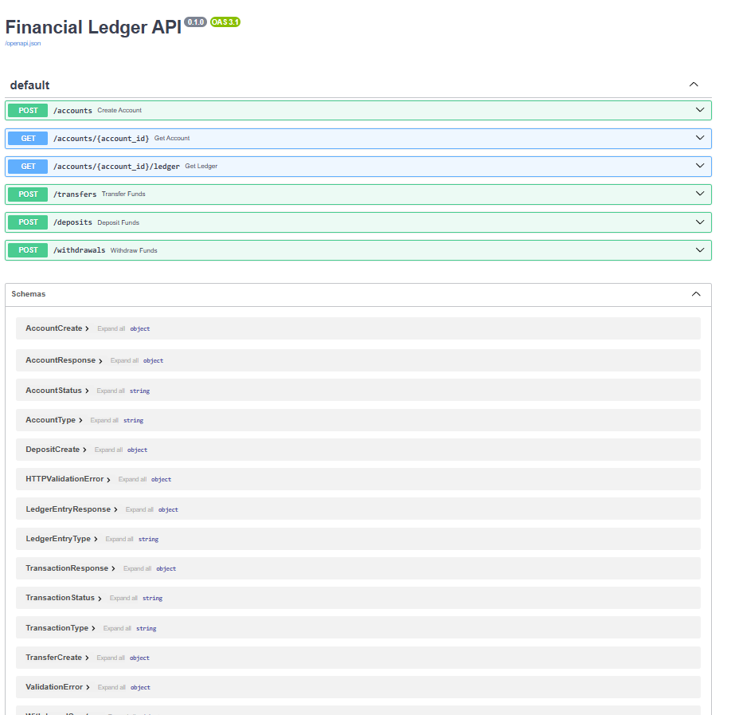
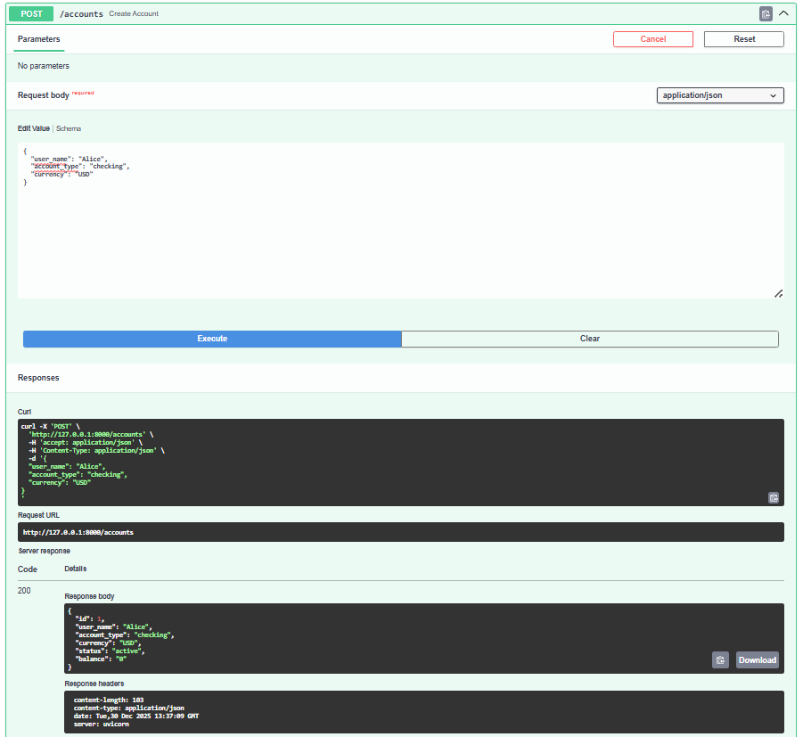
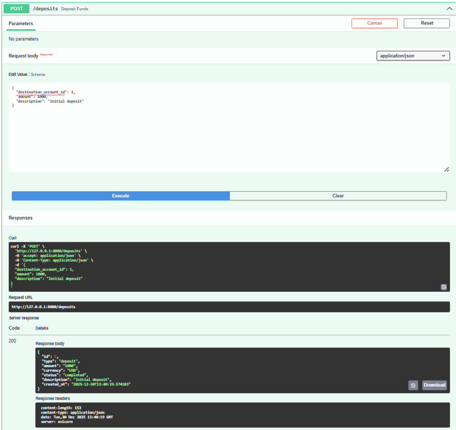
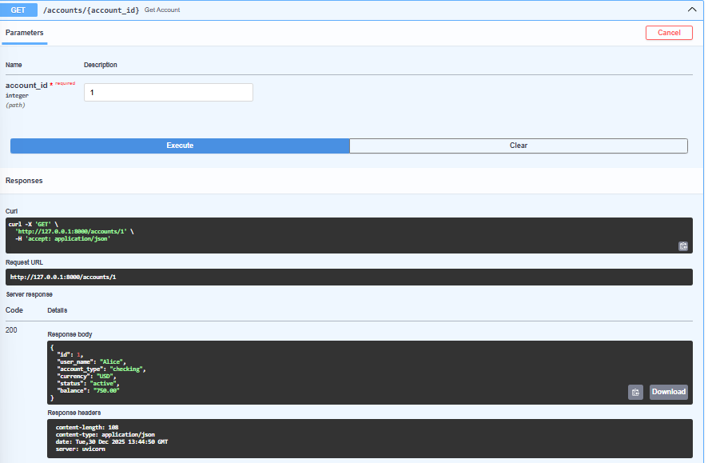
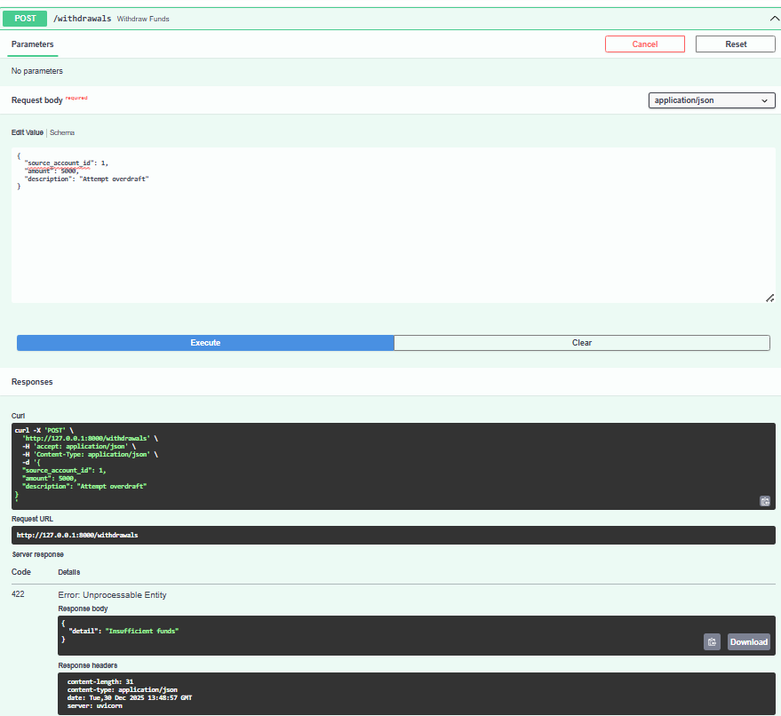

### Financial Ledger API — Double Entry Accounting System
A production-grade Financial Ledger API implementing double-entry bookkeeping, immutable transactions, accurate balance handling, and atomic concurrent transfers using FastAPI and PostgreSQL.
________________________________________
### Features Implemented

• Create financial accounts
• Credit and debit transactions
• Atomic money transfers (debit + credit)
• Immutable ledger entries
• Accurate balance updates within transactions
• Complete transaction history per account
• Swagger (OpenAPI) documentation
• PostgreSQL persistence
• SQLAlchemy transactional session handling
________________________________________
### Project Folder Structure

ledger-api/
├── app/
│ ├── init_db.py
│ ├── main.py
│ ├── db.py 
│ ├── models.py 
│ ├── schemas.py 
│ ├── services.py 
│ ├── utils.py 
│ ├── test_db.py 
├── screenshots/
├── docker-compose.yml
├── Dockerfile
├── requirements.txt
├── README.md
└── .gitignore

________________________________________
### Tech Stack

• Python 3.11
• FastAPI
• SQLAlchemy
• Pydantic
• PostgreSQL
• Docker & Docker Compose
• Swagger UI (auto-generated by FastAPI)
________________________________________
### ACID Transaction Strategy

All financial operations are executed inside a single database transaction using SQLAlchemy’s transactional session handling.

Ledger entry creation, transaction status updates, and balance updates are committed together. If any step fails, the entire transaction is rolled back, guaranteeing atomicity and consistency.
____________________________________________
### API Endpoints Overview

1. POST /accounts 
   Create a new account

2. GET /accounts/{accountId} 
   Retrieve account details 

3. GET /accounts/{accountId}/ledger 
   Fetch  ledger entries for an account

4. POST /transactions
   Handle deposit, withdrawal, and transfer transactions
________________________________________
### How the Ledger System Works

Double Entry Bookkeeping
Every financial transaction generates ledger entries:

• Debit entry → amount deducted from an account
• Credit entry → amount added to an account

Each transfer creates two ledger entries (one debit, one credit) linked by a single transaction record.

Ledger Is Immutable
Once written, ledger entries are never updated or deleted.
This provides a permanent and auditable financial history. 
____________________________________________
### Balance Calculation Strategy

Account balances are **calculated on-demand** by summing all debit and credit ledger entries for an account.  

This ensures:

• Accuracy – balances always match the ledger.  
• Immutability – the ledger is the single source of truth.  
• Atomicity – all balance updates occur within the same database transaction as ledger entry creation, preventing inconsistencies.  

This approach mirrors real-world financial systems, combining correctness (ledger as truth) with safety.

_____________________________________________ 
### API Usage Examples

Base URL: http://localhost:8000

1. Create Account

Request
POST /accounts

Request Body
{
    "user_name": "Mona Savings",
    "account_type": "checking",
    "currency": "USD"
}

Response
{
    "id": 1,
    "user_name": "Mona Savings",
    "account_type": "checking",
    "currency": "USD",
    "status": "active",
    "balance": "0.00"
}

2. Deposit Transaction

Request
POST /deposits

Request Body
{
    "destination_account_id": 1,
    "amount": 300,
    "description": "Initial deposit"
}

3. Transfer Transaction

Request
POST /transfers

Request Body
{
    "source_account_id": 1,
    "destination_account_id": 2,
    "amount": 200,
    "description": "Transfer from savings to checking"
}

4. Verify Account Balance

Request
GET /accounts/1

Response
{
    "id": 1,
    "user_name": "Mona Savings",
    "account_type": "checking",
    "currency": "USD",
    "status": "active",
    "balance": "100.00"
}

5. View Ledger Entries

Request
GET /accounts/1/ledger

Response
[
    {
        "id": 1,
        "account_id": 1,
        "transaction_id": 1,
        "entry_type": "credit",
        "amount": "300.00",
        "created_at": "2026-01-01T06:46:56.260391"
    }
]

6. Withdrawal Transaction

Request
POST /withdrawals

Request Body
{
    "source_account_id": 1,
    "amount": 100,
    "description": "ATM withdrawal"
}

_____________________________________________
### Diagrams

 1. High-Level Architecture
+-------------------+        +------------------------+        +---------------------+
|                   | HTTP   |                        |        |                     |
|     CLIENT        +------->+    FASTAPI ROUTES      +------->+    BUSINESS LOGIC   |
| (Swagger/Postman) |        |  (Accounts, Txns)     |         |   (Business Rules)  |
|                   |        |                        |        |                     |
+-------------------+        +-----------+------------+        +----------+----------+
                                           |                               |
                                           | SQLAlchemy ORM                |
                                           v                               v
                                +---------------------+        +----------------------+
                                | Account Model       |        | LedgerEntry Model    |
                                | Transaction Model   |        |                      |
                                +---------------------+        +----------------------+
                                            \                          /
                                             \                        /
                                              \                      /
                                               v                    v
                                         +--------------------------------+
                                         |          POSTGRESQL DB         |
                                         |Accounts | Transactions | Ledger|
                                         +--------------------------------+

 2. Data Flow (Credit / Debit)
User (Swagger / Postman)
        |
        | POST /transactions/
        v
+--------------------+
|   FastAPI Route    |
|  (main.py)         |
+--------------------+
        |
        | Validate request (Pydantic schema)
        v
+--------------------+
|  Service Logic     |
|  (SQLAlchemy DB    |
|   session)         |
+--------------------+
        |
        | Begin DB transaction
        |
        | Fetch source account (if any)
        | Fetch destination account (if any)
        |
        | Check sufficient balance
        | (for transfer / withdrawal)
        |
        | Create Transaction record
        |
        | Create Ledger Entry (DEBIT)
        | → Source account
        |
        | Create Ledger Entry (CREDIT)
        | → Destination account
        |
        | Update account balances
        |
        | Commit transaction
        v
+--------------------+
|  PostgreSQL DB     |
|--------------------|
| accounts           |
| transactions       |
| ledger_entries     |
+--------------------+
        ^
        |
        | Return response
        |
+--------------------+
|  API Response      |
|  (Transaction OK)  |
+--------------------+

 3. Double-Entry Ledger Diagram
LedgerEntry ID | Account | Entry Type | Amount | Transaction
1              | 1       | debit      | 200    | transfer
2              | 2       | credit     | 200    | transfer
3              | 1       | credit     | 300    | deposit
4              | 2       | debit      | 100    | withdrawal         
________________________________________
### Expected Outcomes

• Fully functional REST API
• Atomic financial transfers
• Immutable ledger design
• Safe concurrency using database transactions
• Prevention of negative balances
• Complete financial audit trail
• Production-ready architecture
________________________________________
### How to Run

1. Ensure Docker and Docker Compose are installed

2. Clone the repository

git clone <repo-url>
cd ledger-api

3. Start the application

docker-compose up --build

4. Open Swagger UI

http://localhost:8000/docs
_________________________________________
### Screenshots
1. Swagger UI

2. Account 1 Created

 
3. Account 2 Created

4. Deposit Transaction

5. Get Account 1 Details

6. Get Account 2 Details

7. Transfer Transaction

8. Withdrawal Transaction

9. Withdrawal Error (Insufficient Balance)

10. Ledger Entries

________________________________________
### Conclusion

This project demonstrates:
• Correct implementation of double-entry bookkeeping
• Financial-grade transactional consistency
• Clean and scalable backend architecture
• Real-world ledger and audit design principles.